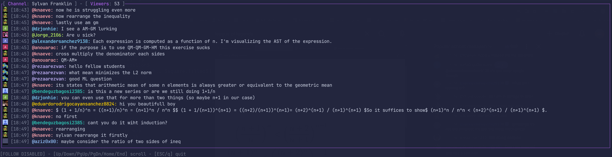

# youtube-chat-rs

YouTube chat in the terminal.

A terminal UI (TUI) app for viewing YouTube live chat. Currently only supports reading live messages, with more interactive features planned.

## How to Use

1. Create a Google Cloud project and enable the YouTube Data API.

2. Download your client_secret.json (OAuth credentials).

3. Run the application.