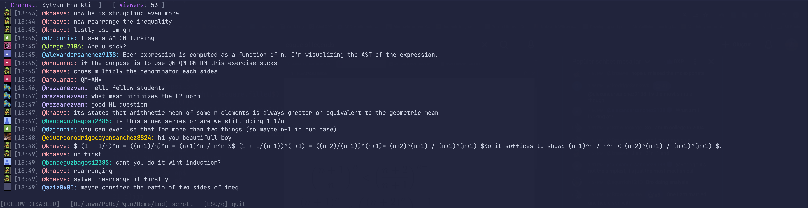

<div align="center">

# youtube-chat-rs

YouTube chat in the terminal.



</div>

A terminal UI (TUI) app for viewing YouTube live chat. Currently only supports reading live messages, with more interactive features planned. 

> Avatar rendering currently works only in **Kitty** terminals. Other terminals will display chat without avatars.

## Install

### Homebrew

```bash
brew install efekrskl/tap/ytc
```

### First Run Requirements

- A Google Cloud project with the YouTube Data API enabled
- OAuth desktop app credentials downloaded as `client_secret.json`

## How to Use

Run the application and connect to a stream using one of the following:

```bash
ytc --video-id <VIDEO_ID>

or

ytc --channel-name <CHANNEL_NAME>
```

or during local development

```bash
cargo run -- --video-id <VIDEO_ID>
```

If this is your first time running the app, you will be prompted for auth.
